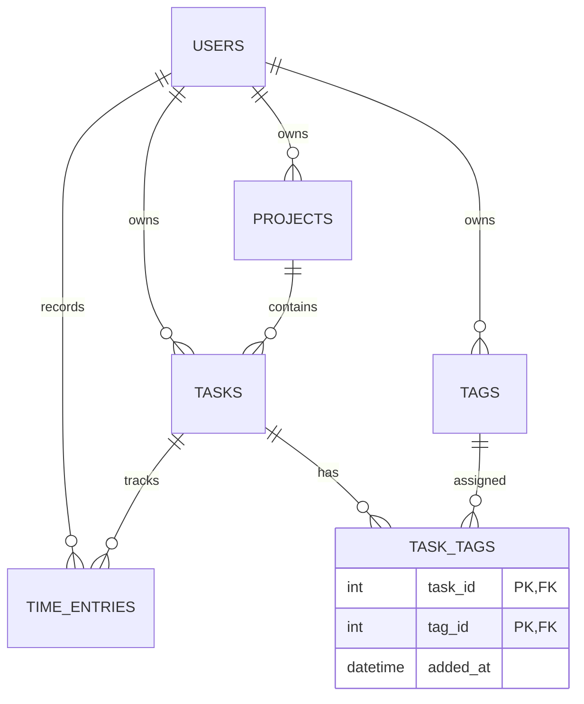

# ER-диаграмма TimeFlow

```mermaid
erDiagram
    USERS ||--o{ PROJECTS : owns
    USERS ||--o{ TASKS : owns
    USERS ||--o{ TAGS : owns
    USERS ||--o{ TIME_ENTRIES : records
    PROJECTS ||--o{ TASKS : contains
    TASKS ||--o{ TIME_ENTRIES : tracks
    TASKS ||--o{ TASK_TAGS : has
    TAGS ||--o{ TASK_TAGS : assigned

    TASK_TAGS {
        int task_id PK,FK
        int tag_id PK,FK
        datetime added_at
    }
```

