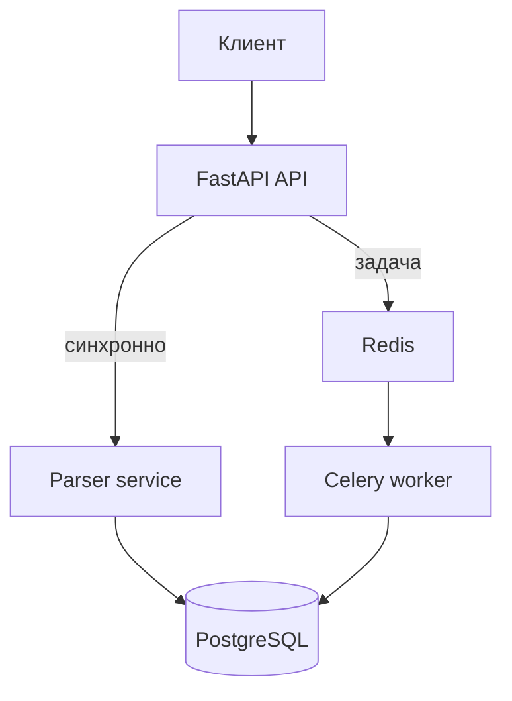

# Лабораторная работа №3. Docker, источники данных и очереди

**Выполнила:** Мельникова Анастасия  
**Группа:** К3341

## Цель работы

Упаковать FastAPI-приложение в Docker, связать его с PostgreSQL и отдельным сервисом парсинга, а также реализовать фоновое выполнение задач при помощи Celery и Redis.

## Архитектура проекта

В работе используются пять контейнеров:

| Контейнер | Назначение | Порт |
|---|---|---:|
| `api` | Основное приложение TimeFlow и публичные API-методы | 8000 |
| `parser` | Загрузка HTML, извлечение заголовка и сохранение результата | 8001 |
| `db` | База данных PostgreSQL из лабораторной работы №1 | 5432 внутри сети |
| `redis` | Брокер очереди и хранилище результатов Celery | 6379 внутри сети |
| `celery-worker` | Фоновая обработка заданий парсинга | — |



Контейнеры обращаются друг к другу по именам сервисов Docker Compose: `db`, `parser` и `redis`. Поэтому внутри контейнера нельзя использовать `localhost` для обращения к соседнему сервису.

## Подзадание 1. Docker-контейнеры

Для приложения созданы три Dockerfile:

- `docker/api.Dockerfile` — устанавливает зависимости, выполняет миграции Alembic, создаёт демонстрационного пользователя и запускает TimeFlow;
- `docker/parser.Dockerfile` — запускает отдельный FastAPI-сервис парсера;
- `docker/worker.Dockerfile` — запускает Celery worker.

Файл `docker-compose.yml` описывает все сервисы, переменные окружения, зависимости, healthcheck для PostgreSQL и Redis, а также постоянный том `postgres_data`.

Команда запуска:

```bash
docker compose up --build
```

После сборки документация API доступна по адресам:

- `http://localhost:8000/docs` — основное приложение;
- `http://localhost:8001/docs` — сервис парсера.

### Скриншот запуска контейнеров


## Подзадание 2. Синхронный вызов парсера

В основном приложении реализован метод:

```text
POST /parser/sync
```

Пример тела запроса:

```json
{
  "url": "https://example.com",
  "user_id": 1
}
```

Основное API отправляет HTTP-запрос контейнеру `parser`. Сервис загружает страницу, извлекает содержимое тега `title`, создаёт задачу в таблице `tasks` и возвращает клиенту URL, заголовок и идентификатор записи.

Пример ответа:

```json
{
  "url": "https://example.com/",
  "title": "Example Domain",
  "task_id": 1
}
```

Для URL выполняется проверка схемы и адреса. Доступ к локальным и служебным IP-адресам запрещён.

### Скриншот синхронного запроса


## Подзадание 3. Celery и Redis

Для фоновой обработки реализован метод:

```text
POST /parser/async
```

Он не ожидает загрузки страницы, а помещает задание `worker.tasks.parse_url_task` в Redis и немедленно возвращает HTTP 202:

```json
{
  "task_id": "идентификатор-задачи",
  "status": "queued"
}
```

Celery worker забирает задание, запускает парсер и записывает результат в PostgreSQL. Состояние и результат можно получить методом:

```text
GET /parser/tasks/{task_id}
```

Возможные состояния: `PENDING`, `STARTED`, `SUCCESS`, `FAILURE`.

### Скриншот фонового запроса


### Скриншот результата Celery


## Тестирование

Тестами проверяются:

- извлечение заголовка HTML;
- обработка страницы без заголовка;
- отклонение недопустимой схемы URL;
- защита от обращения к локальному адресу;
- синхронный API-метод;
- постановка фоновой задачи в очередь.

Команда:

```bash
pytest -q
```

### Скриншот тестов


## Вывод

В ходе лабораторной работы приложение TimeFlow было упаковано в Docker и объединено с PostgreSQL, отдельным сервисом парсинга, Redis и Celery worker. Синхронный метод подходит, когда результат нужен сразу, однако клиент ожидает завершения сетевого запроса. Очередь Celery позволяет быстро принять запрос и выполнить долгую операцию в фоне. Docker Compose обеспечивает воспроизводимый запуск всей системы одной командой.
